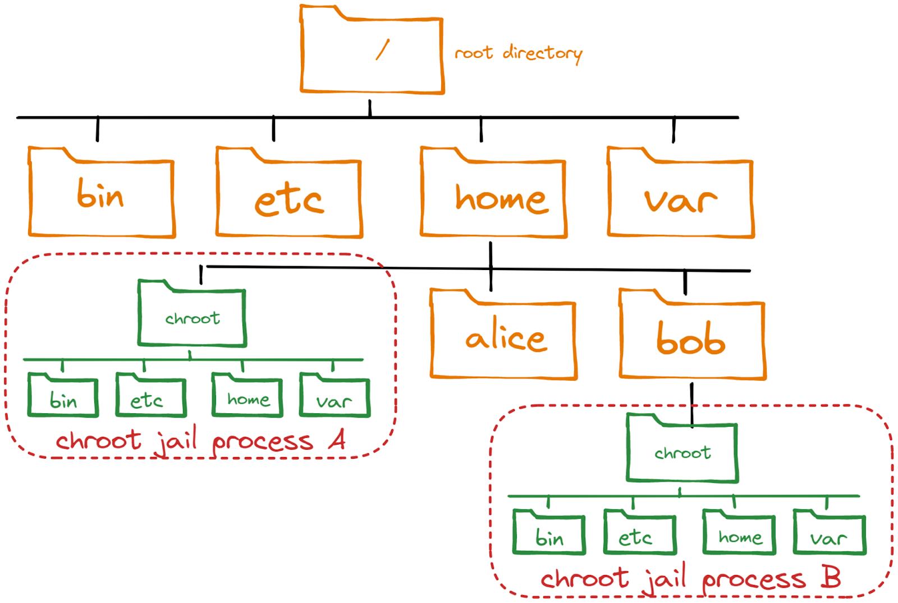
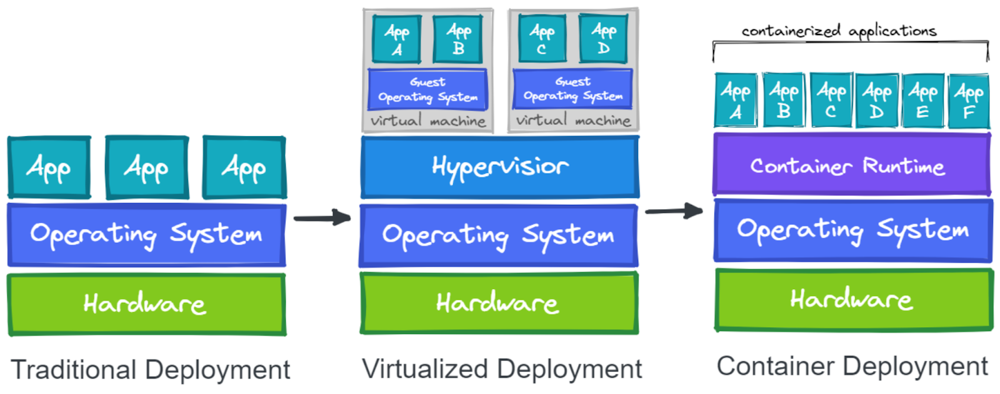

# Container Basics

Contrary to popular belief, container technologies are much older than one would expect. One of the earliest ancestors of modern container technologies is the **chroot** command that was introduced in Version 7 Unix in 1979. The **chroot** command could be used to isolate a process from the root filesystem and basically "hide" the files from the process and simulate a new root directory. The isolated environment is a so-called _chroot jail_, where the files can’t be accessed by the process, but are still present on the system.

### Chroot directories can be created on various places in the filesystem

While chroot is a pretty old technology, it is still in use today by some popular software projects. Container technologies that we have today still embody this very concept, but in a modernized version and with a lot of features on top.

To isolate a process even more than chroot can do, current Linux kernels provide features like _namespaces_ and cgroups.

Namespaces are used to isolate various resources, for example the network. A network namespace can be used to provide a complete abstraction of network interfaces and routing tables. This allows a process to have its own IP address. The Linux Kernel 5.6 currently provides 8 namespaces:

-   **pid** - process ID provides a process with its own set of process IDs.
-   **net** - network allows the processes to have their own network stack, including the IP address.
-   **mnt** - mount abstracts the filesystem view and manages mount points.
-   **ipc** - inter-process communication provides separation of named shared memory segments.
-   **user** - provides process with their own set of user IDs and group IDs.
-   **uts** - Unix time sharing allows processes to have their own hostname and domain name.
-   **cgroup** - a newer namespace that allows a process to have its own set of cgroup root directories.
-   **time** - the newest namespace can be used to virtualize the clock of the system.

cgroups are used to organize processes in hierarchical groups and assign them resources like memory and CPU. When you want to limit your application container to let’s say 4GB of memory, cgroups are used under the hood to ensure these limits.

Launched in 2013, Docker became synonymous with building and running containers. Although Docker did not invent the technologies that are used to run containers, they stitched together existing technologies in a smart way to make containers more user friendly and accessible.

At a first glance, containers seem to be very similar to virtual machines, but it’s crucial to understand that they are very different. While virtual machines emulate a complete machine, including the operating system and a kernel, containers share the kernel of the host machine and, as explained, are only isolated processes.

Virtual machines come with some overhead, be it boot time, size or resource usage to run the operating system. Containers on the other hand are literally processes, like the browser you can start on your machine, therefore they start a lot faster and have a smaller footprint.

### Traditional Deployment vs Virtualized Deployment vs Container Deployment

  
In many cases it is not a question of whether you are using containers or virtual machines, rather you are using both technologies to benefit from the efficiency that containers have but still use the security advantages that the greater isolation of virtual machines bring to the table.