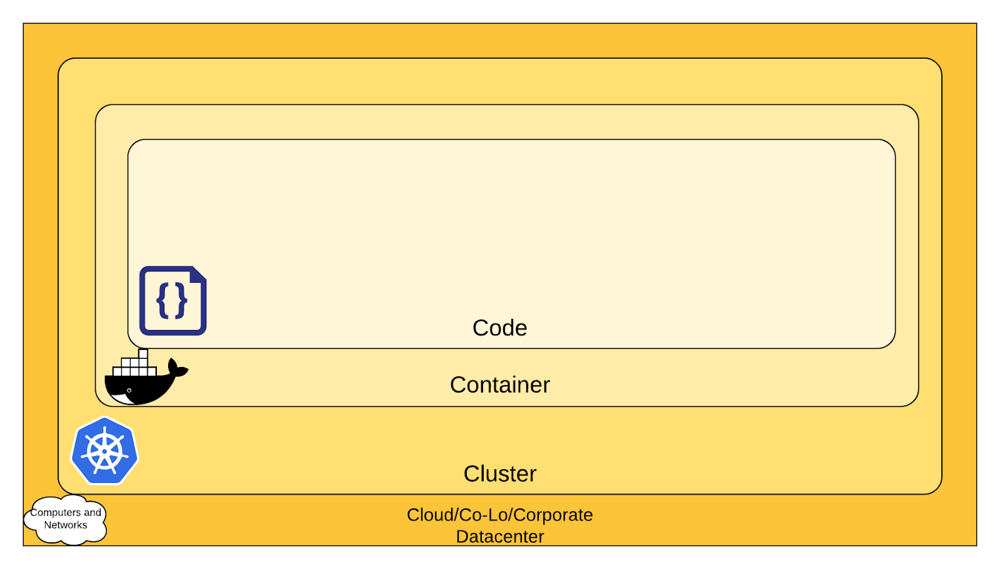

# Security

It is important to understand that containers have different security requirements than virtual machines. A lot of people rely on the isolation properties of containers, but that can be very dangerous.

When containers are started on a machine, they always share the same kernel, which then becomes a risk for the whole system, if containers are allowed to call kernel functions like for example killing other processes or modifying the host network by creating routing rules. You can learn more about kernel capabilities in the [Docker documentation](https://docs.docker.com/engine/security/#linux-kernel-capabilities).

One of the greatest security risks, not only in the container area, is the execution of processes with too many privileges, especially starting processes as root or administrator. Unfortunately, this is a problem that got ignored a lot in the past and there are a lot of containers out there that run as root users.

A fairly new attack surface that was introduced with containers is the use of public images. Two of the most popular public image registries are [Docker Hub](https://hub.docker.com/) and [Quay](https://quay.io/) and while it’s great that they provide publicly accessible images, you have to make sure that these images were not modified to include malicious software.

Sysdig has a great [blog article on how to avoid a lot of security issues and build secure container images](https://sysdig.com/blog/dockerfile-best-practices/).

Security in general is not something that can be achieved only at the container layer. It’s a continuous process that needs to be adapted all the time. The 4C's of Cloud Native security can give a rough idea what layers need to be protected if you’re using containers. Make sure to cover every layer since it’s effectively protecting the layer within. The [Kubernetes documentation](https://kubernetes.io/docs/concepts/security/overview/) is a good starting point to understand the layers.

**The 4C's of Cloud Native Security**, retrieved from the [Kubernetes documentation](https://kubernetes.io/docs/concepts/security/overview/)