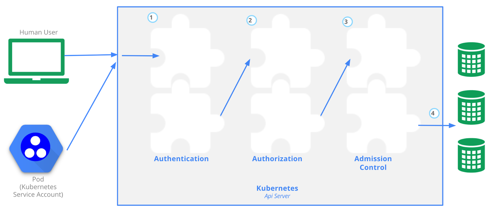

# Kubernetes API

The Kubernetes API is the most important component of a Kubernetes cluster. Without it, communication with the cluster is not possible, every user and every component of the cluster itself needs the api-server.

**Access Control Overview**, retrieved from the [Kubernetes documentation  
](https://kubernetes.io/docs/concepts/security/controlling-access/)  

Before a request is processed by Kubernetes, it has to go through three stages:

-   **Authentication**  
> The requester needs to present a means of identity to authenticate against the API. Commonly done with a digital signed certificate ([X.509](https://en.wikipedia.org/wiki/X.509)) or with an external identity management system. Kubernetes users are _always_ externally managed. [Service Accounts](https://kubernetes.io/docs/reference/access-authn-authz/service-accounts-admin/) can be used to authenticate technical users.
-   **Authorization**  
> It is decided what the requester is allowed to do. In Kubernetes this can be done with [Role Based Access Control (RBAC)](https://kubernetes.io/docs/reference/access-authn-authz/rbac/).
-   **Admission Control**  
> In the last step, [admission controllers](https://kubernetes.io/docs/reference/access-authn-authz/admission-controllers/) can be used to modify or validate the request. For example, if a user tries to use a container image from an untrustworthy registry, an admission controller could block this request. Tools like the [Open Policy Agent](https://www.openpolicyagent.org/) can be used to manage admission control externally.

Like many other APIs, the Kubernetes API is implemented as a RESTful interface that is exposed over HTTPS. Through the API, a user or service can create, modify, delete or retrieve resources that reside in Kubernetes.