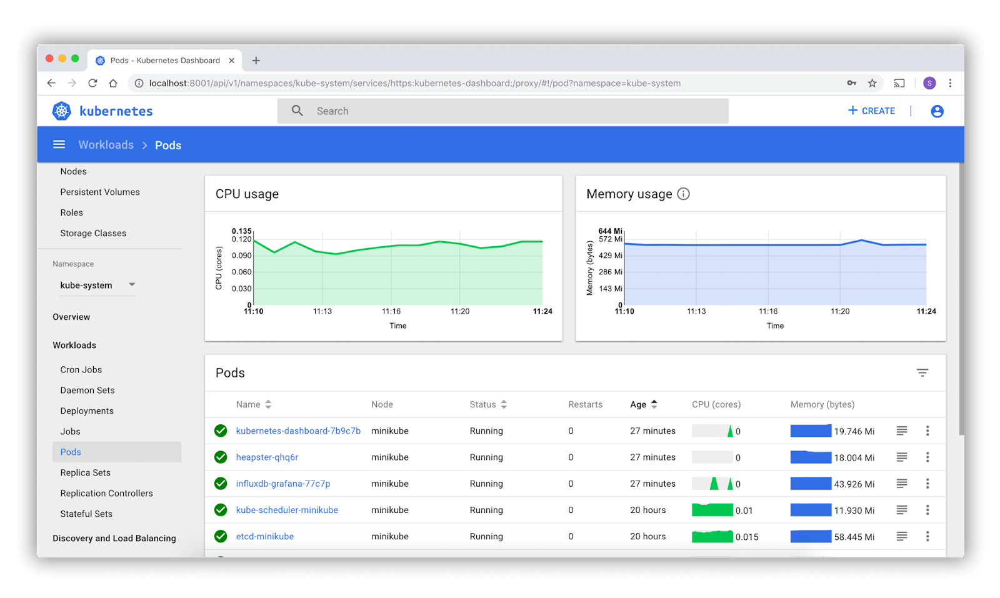

# Interacting with Kubernetes

To access the API, users can use the official command line interface client called **kubectl**. Lets look at some basic commands for everyday Kubernetes usage.

**NOTE:** You can learn how to install **kubectl** in the [official documentation](https://kubernetes.io/docs/tasks/tools/#kubectl).

You can list the available objects in your cluster with the following command:

```bash
$ kubectl api-resources**

**NAME                    SHORTNAMES  APIVERSION  NAMESPACED  KIND  
...  
configmaps              cm          v1          true        ConfigMap  
...  
namespaces              ns          v1          false       Namespace  
nodes                   no          v1          false       Node  
persistentvolumeclaims  pvc         v1          true        PersistentVolumeClaim  
...  
pods                    po          v1          true        Pod  
...  
services                svc         v1          true        Service
```

Note how objects have short names. That is very helpful for objects with longer names like **configmaps** or **persistentvolumeclaims**. The table also shows which objects are namespaced and in what version they’re available.

If you want to know more about an object, **kubectl** has a built-in explanation function!

Let’s learn more about pods:

```bash
$ kubectl explain pod**

**KIND:     Pod  
VERSION:  v1**

**DESCRIPTION:  
     Pod is a collection of containers that can run on a host. This resource is       
     created by clients and scheduled onto hosts.** 

**FIELDS:   
   apiVersion <string>       
     APIVersion defines the versioned schema of this representation of an**     **object. Servers should convert recognized schemas to the latest internal           
     value, and may reject unrecognized values.  
...  
   kind <string>  
...  
   metadata <Object>  
...  
   spec <Object>
```

To learn more about the pod spec, you can drill down in the object definition. Use the format: `<type>.<fieldName>[.<fieldName>]`

```bash
$ kubectl explain pod.spec**

**

**KIND:     Pod  
VERSION:  v1** 

**RESOURCE: spec <Object>**  

**DESCRIPTION:  
     Specification of the desired behavior of the pod. More info:  
  
https://git.k8s.io/community/contributors/devel/sig-architecture/api-conventions.md#spec-and-status**      

     **PodSpec is a description of a pod.** 

**FIELDS:  
   activeDeadlineSeconds <integer>       
     Optional duration in seconds the pod may be active on the node relative to         
     StartTime before the system will actively try to mark it failed and kill           
     associated containers. Value must be a positive integer.** 

   **affinity <object>       
     If specified, the pod's scheduling constraints** 

   **automountServiceAccountToken <boolean>       
     AutomountServiceAccountToken indicates whether a service account token             
     should be automatically mounted.** 

   **containers <[]Object> -required-  
...**

```

Let’s take a look at the basic **kubectl** commands. You can use the **--help** flag to view them:

```bash
**$ kubectl --help**

**kubectl controls the Kubernetes cluster manager.** 

 **Find more information at: https://kubernetes.io/docs/reference/kubectl/overview/** 

**Basic Commands (Beginner):  
  create Create a resource from a file or from stdin  
  expose Take a replication controller, service, deployment or pod and expose it as a new Kubernetes service  
  run Run a particular image on the cluster  
  set Set specific features on objects** 

**Basic Commands (Intermediate):  
  explain Get documentation for a resource  
  get Display one or many resources  
  edit Edit a resource on the server  
  delete Delete resources by file names, stdin, resources and names, or by resources and label selector**
```

To create an object in Kubernetes from a YAML file you can use the following command:

```bash
**kubectl create -f <your-file>.yaml**
```

There are plenty of graphic user interfaces and dashboards for Kubernetes that allow a visual interaction with the cluster.



Other tools for interaction with Kubernetes:

-   [kubernetes/dashboard](https://github.com/kubernetes/dashboard)
-   [derailed/k9s](https://github.com/derailed/k9s)
-   [Lens](https://k8slens.dev/)
-   [VMware Tanzu Octant](https://github.com/vmware-tanzu/octant)

Despite the numerous CLI tools and GUIs, there are also advanced tools that allow the creation of templates and the packaging of Kubernetes objects. Probably the most frequently used tool in connection with Kubernetes today is [Helm](https://helm.sh/).

Helm is a package manager for Kubernetes, which allows easier updates and interaction with objects. Helm packages Kubernetes objects in so-called Charts, which can be shared with others via a registry. To get started with Kubernetes, you can search the [ArtifactHub](https://artifacthub.io/) to find your favorite software packages, ready to deploy.

<!--Add kubectl example here->
